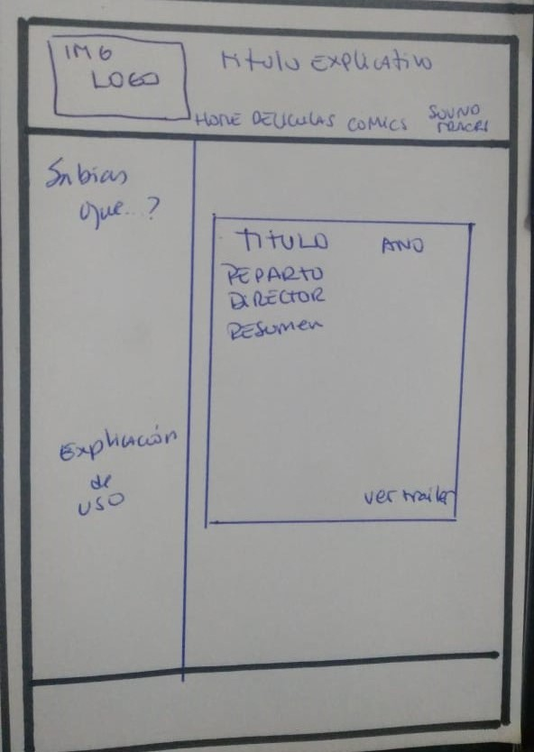
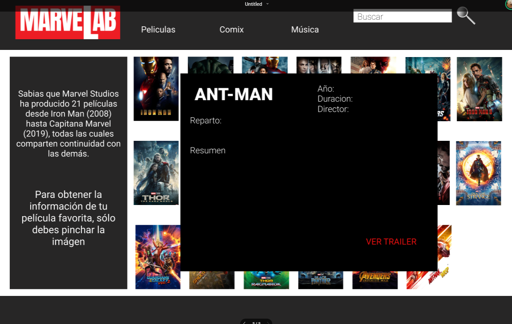

 

 ## Índice

 * [Sobre MarveLab](#Sobre-MarveLab)
* [Planificación](#Planificación)
* [Usuarios](#Usuarios)
* [Pasos para la creación de la pagína](#Pasos-para-la-creación-de-la-pagina)
* [Organización](#organizacion)
* [Tester](Testeos)
* [Conclusiones y desafíos que continuan](#conclusiones-y-desafíos-que-continuan)

 ***

 ## Sobre MarveLab

La idea principal al crear MarveLab es hacer una web simple con la información necesaria para que los usuarios conozcan sobre el Universo Marvel. Puedan ver la información de las películas, ver Trailers , saber en que orden verlas y ademas tener acceso rápido a las bandas sonoras y cómics.

 

 ## Planificación

 La planificación de nuestro sitio puedes encontrarla en el siguiente Link:
 href=https://trello.com/b/0QKYnMqp/marvel

 ## Usuarios y estudio previo 

 Nos enfocamos en dos grandes grupos de usuarios  los que ya saben sobre las películas de Marvel, esos que son fanaticos. Y los que están interesados en conocer sobre ellas, en comenzar a explorar el mundo de las peliculas Marvel.
 Se realizaron encuestas para realizar las historias de Usuario  , Obtuvimos 32 respuestas.

 [Puedes ver los resultados de estas encuestas Aquí <----](https://goo.gl/forms/8Se05ez7hFWepGhM2)

 ## Pasos para la creación de la pagína 
  #### Historias de usuarios
  Una vez relizadas las encuentas se construyeron las historias de usuarios. 
  Para poder acceder a ellas se creó un tablero con las tareas realizadas para poder crear las historias de usuarios [revisalas Aquí <--](https://trello.com/b/0QKYnMqp/marvel)
  * Los criterios de apcepación para las hisorias de usuaro son las siguentes: 
   * Que el usuario pueda revisar el catalogo ordenado por años y así pueda verlas cronológicamente.
   * Que el usuario pueda ordenar las peliculas por orden alfabetico
   * Que el usuario pueda ver los poster de todas las películas para que se familiarice con ellas
   * Que  el usuario pueda ver en un solo lugar todos los trailers de las películas de Marvel y decidir cual verá
   * Mostrar al usuario un link para poder escuchar y descargar todas las bandas sonoras
   * Mostrar al usuario un link para poder escuchar y descargar todos los cómics disponibles
   #### Diagrama de Flujo
   Lugo de las historias de usuario se pudo saber que funciones y que funcionalidad le daríamos a la pagína, lo primero fue hacer un diagrama de flujo.
   

#### Prototipo de Baja fidelidad
   
 

#### Prototipo de Alta fidelidad

#### Prototipo de Alta fidelidad
[Tablero prototipo de alta fidelidad<--- Acá](https://www.figma.com/proto/SJnwHMfo6eRvtrlGAXoaZxSn/Untitled?node-id=0:1&amp;scaling=min-zoom)

## Tester
Se realizaron testeos a usuarios, los feedback que más se repitieron fueron los siguientes: 
* Que tenga un tipo de filtro
* Que el usuario pueda realizar busqueda de una película en particular
* Imágenes algo más dinámicas 

## Organización
Para poder hacer frente a este proyecto nos dividimos las gunciones, pero siempre con constante retroalimentación y aportando ideas en el trabajo de cada una.
*  **Joce Casteletti** Se encargo del DOM en funciones de logistica y diseño del proyecto.
*   **Maria José Marquez** Fue la encargada de el estudio de usuario, realiazación de readme y prototipos, también en creación de html.
*    **Valeska Pérez Retamal** Se encargó del codigo, funciones del DOM y la logistica del proyecto, erealizar Readme y diseño del proyecto.
[Ingresa a nuestra pagína <---Acá](https://valeskaperezrretamal.github.io/SCL008-hackathon-peliculas/index.html)
 

## Conclusiones y desafios que continuan
Los desafios que nos quedan por delante, para un siguiente sprint serpian:
* Realizar tipos de filtros, como por ejemplo que se muestren las peliculas de algun director en particular (enfocado para los fanaticos de Marvel)
* Lograr hacer la pagína algo más interactiva con el usuario, como el poder realizar busqueda concreta, a través de un buscador dentro de la pagína
* Poder ir agregando las futuras peliculas de Marvel
* Realizar algun blog de criticas a las peliculas 

 

 